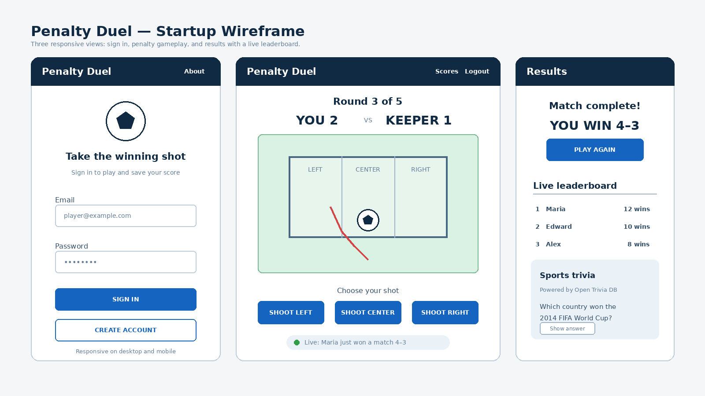
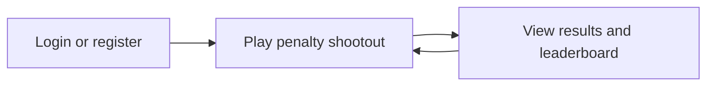

# Penalty Duel

[My Notes](notes.md)

Penalty Duel is an online soccer penalty shootout game. Players choose to shoot left, center, or right and try to beat the goalkeeper. Players will be able to compete, save their scores, and view a live leaderboard.

This project is being developed for BYU CS 260.

> [!NOTE]
> This is a template for your startup application. You must modify this `README.md` file for each phase of your development. You only need to fill in the section for each deliverable when that deliverable is submitted in Canvas. Without completing the section for a deliverable, the TA will not know what to look for when grading your submission. Feel free to add additional information to each deliverable description, but make sure you at least have the list of rubric items and a description of what you did for each item.

> [!NOTE]
> If you are not familiar with Markdown then you should review the [documentation](https://docs.github.com/en/get-started/writing-on-github/getting-started-with-writing-and-formatting-on-github/basic-writing-and-formatting-syntax) before continuing.

### Elevator pitch

Penalty Duel turns the excitement of a soccer shootout into a quick online competition. Players choose where to shoot, challenge the goalkeeper or another player, and climb the live leaderboard as results update instantly. Whether you have a minute between classes or want to compete with friends, every kick creates a simple, fast, and replayable battle for bragging rights.

### Design

The wireframe shows the three main views of the application:

- **Login view** - Players can create an account or sign in to save their progress.
- **Game view** - Players can see the score, choose a shooting direction, and receive the result of each penalty kick.
- **Results view** - Players can see the final score, play again, view the live leaderboard, and answer a sports trivia question.

### Key features

- Secure account registration and login.
- Five-round penalty shootouts with left, center, and right shooting options.
- Immediate visual feedback showing whether each shot was scored or saved.
- Single-player matches against the computer and online matches against another player.
- Player statistics including total wins, losses, scores, and best winning streak.
- A live leaderboard and activity feed that update when other players finish matches.
- A sports trivia question provided by the Open Trivia DB API after each match.
- A responsive interface that works on desktop and mobile screens.

### Technologies

I am going to use the required technologies in the following ways.

- **HTML** - Provides the structure for the login, game, results, leaderboard, trivia, and navigation views.
- **CSS** - Creates a responsive soccer-themed layout for desktop and mobile screens and provides animations for shots, goals, and saves.
- **React** - Provides reusable components for login, gameplay, scoring, the leaderboard, and trivia. React Router will move users between views, and React state will update the score and game status after each shot.
- **Service** - A Node.js and Express backend will provide endpoints to register, log in, log out, start matches, submit shots, save match results, and retrieve player statistics and leaderboard scores. After each match, the service will request a sports trivia question from the [Open Trivia DB API](https://opentdb.com/api_config.php).
- **Database/Login** - MongoDB will securely store user accounts, hashed passwords, match results, total wins and losses, scores, and winning streaks.
- **WebSocket** - The server will send real-time opponent actions, completed-match notifications, activity feed messages, and leaderboard updates to all connected players.

## 🚀 Specification Deliverable

> [!NOTE]
> Fill in this sections as the submission artifact for this deliverable. You can refer to this [example](https://github.com/webprogramming260/startup-example/blob/main/README.md) for inspiration.

For this deliverable I did the following. I checked the box `[x]` and added a description for things I completed.

- [x] **Prerequisites** - I created the startup repository and used separate Git commits to document each completed part of the specification.
- [x] **Proper use of Markdown** - I organized the README with headings, bullet lists, links, an embedded image, and a Mermaid navigation diagram.
- [x] **Elevator pitch** - I added a concise elevator pitch explaining the purpose, audience, and value of Penalty Duel.
- [x] **Key features** - I documented authentication, penalty gameplay, scoring, player statistics, live updates, sports trivia, and responsive design.
- [x] **Technology descriptions** - I explained how the application will use HTML, CSS, React, Node.js and Express, MongoDB, the Open Trivia DB API, and WebSocket.
- [x] **Design sketches** - I added an embedded wireframe showing the login, gameplay, and results views, along with a navigation flow diagram.

## 🚀 AWS deliverable

For this deliverable I did the following:

- [x] **Rented EC2 server** - I created a `t3.nano` EC2 instance using the Web Programming 260 Server v8 AMI and verified that it is accessible.
- [x] **Leased domain name** - I registered `edwardgm260.click` through Amazon Route 53 and configured DNS records that point to my EC2 server.
- [x] **Server accessible** from my domain: [https://startup.edwardgm260.click](https://startup.edwardgm260.click) - I configured Caddy and verified that the startup placeholder is available through HTTPS.

## 🚀 HTML deliverable

For this deliverable I did the following. I checked the box `[x]` and added a description for things I completed.

- [x] **Prerequisites** - I deployed Simon, included my GitHub link, and made Git commits throughout the work.
- [x] **HTML pages** - I created `index.html`, `play.html`, `scores.html`, and `about.html`.
- [x] **Proper HTML element usage** - I used semantic elements including `header`, `nav`, `main`, `section`, `footer`, forms, tables, and lists.
- [x] **Links** - I added navigation links between all pages and a link to my GitHub repository.
- [x] **Text** - I included descriptions, instructions, match information, scores, and player statistics.
- [x] **3rd party API placeholder** - The About page contains a placeholder for stadium weather information.
- [x] **Images** - The Home and About pages display an image placeholder with descriptive alternative text.
- [x] **Login placeholder** - The Home page contains email and password fields with Login and Create Account buttons.
- [x] **DB data placeholder** - The Scores page contains a leaderboard and player statistics that will come from the database.
- [x] **WebSocket placeholder** - The Play page contains a section for live match updates from another player.

## 🚀 CSS deliverable

For this deliverable I did the following. I checked the box `[x]` and added a description for things I completed.

- [ ] I completed the prerequisites for this deliverable (Simon deployed, GitHub link, Git commits)
- [ ] **Visually appealing colors and layout. No overflowing elements.** - I did not complete this part of the deliverable.
- [ ] **Use of a CSS framework** - I did not complete this part of the deliverable.
- [ ] **All visual elements styled using CSS** - I did not complete this part of the deliverable.
- [ ] **Responsive to window resizing using flexbox and/or grid display** - I did not complete this part of the deliverable.
- [ ] **Use of a imported font** - I did not complete this part of the deliverable.
- [ ] **Use of different types of selectors including element, class, ID, and pseudo selectors** - I did not complete this part of the deliverable.

## 🚀 React part 1: Routing deliverable

For this deliverable I did the following. I checked the box `[x]` and added a description for things I completed.

- [ ] I completed the prerequisites for this deliverable (Simon deployed, GitHub link, Git commits)
- [ ] **Bundled using Vite** - I did not complete this part of the deliverable.
- [ ] **Components** - I did not complete this part of the deliverable.
- [ ] **Router** - I did not complete this part of the deliverable.

## 🚀 React part 2: Reactivity deliverable

For this deliverable I did the following. I checked the box `[x]` and added a description for things I completed.

- [ ] I completed the prerequisites for this deliverable (Simon deployed, GitHub link, Git commits)
- [ ] **All functionality implemented or mocked out** - I did not complete this part of the deliverable.
- [ ] **Hooks** - I did not complete this part of the deliverable.

## 🚀 Service deliverable

For this deliverable I did the following. I checked the box `[x]` and added a description for things I completed.

- [ ] I completed the prerequisites for this deliverable (Simon deployed, GitHub link, Git commits)
- [ ] **Node.js/Express HTTP service** - I did not complete this part of the deliverable.
- [ ] **Static middleware for frontend** - I did not complete this part of the deliverable.
- [ ] **Calls to third party endpoints** - I did not complete this part of the deliverable.
- [ ] **Backend service endpoints** - I did not complete this part of the deliverable.
- [ ] **Frontend calls service endpoints** - I did not complete this part of the deliverable.
- [ ] **Supports registration, login, logout, and restricted endpoint** - I did not complete this part of the deliverable.
- [ ] **Uses BCrypt to hash passwords** - I did not complete this part of the deliverable.

## 🚀 DB deliverable

For this deliverable I did the following. I checked the box `[x]` and added a description for things I completed.

- [ ] I completed the prerequisites for this deliverable (Simon deployed, GitHub link, Git commits)
- [ ] **Stores data in MongoDB** - I did not complete this part of the deliverable.
- [ ] **Stores credentials in MongoDB** - I did not complete this part of the deliverable.

## 🚀 WebSocket deliverable

For this deliverable I did the following. I checked the box `[x]` and added a description for things I completed.

- [ ] I completed the prerequisites for this deliverable (Simon deployed, GitHub link, Git commits)
- [ ] **Backend listens for WebSocket connection** - I did not complete this part of the deliverable.
- [ ] **Frontend makes WebSocket connection** - I did not complete this part of the deliverable.
- [ ] **Data sent over WebSocket connection** - I did not complete this part of the deliverable.
- [ ] **WebSocket data displayed** - I did not complete this part of the deliverable.
- [ ] **Application is fully functional** - I did not complete this part of the deliverable.
